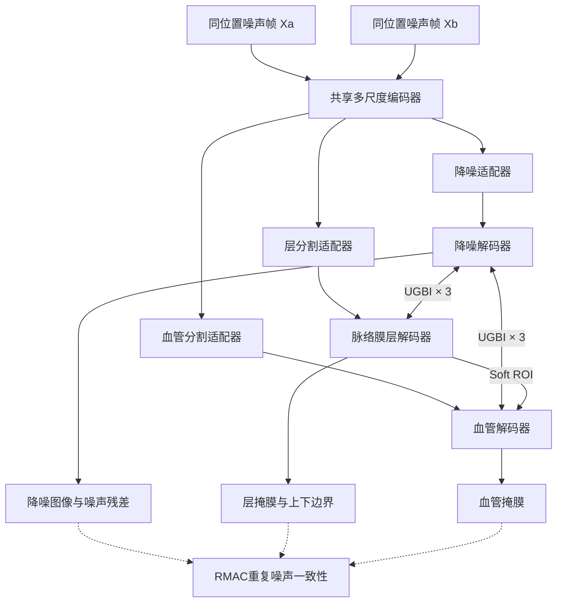

# SABIDS-Net

**Sparse-Annotation-aware Bidirectional Interaction Denoising–Segmentation Network**

> Codex/开发者入口：先阅读根目录的`AGENTS.md`，再根据任务查看
> `docs/PROJECT_CONTEXT.md`、`docs/DATASET_PROTOCOL.md`和
> `docs/EXPERIMENT_LOG.md`。当前已知Joint失败及v0.2修复见
> `RESULT_ANALYSIS.md`。

SABIDS-Net是面向脉络膜OCT图像的多任务学习框架，在一个网络中联合完成：

1. OCT图像降噪；
2. 脉络膜层分割；
3. 脉络膜血管分割；
4. 稀疏血管标注下的半监督学习；
5. 同一位置多次噪声扫描的一致性学习。

项目重点实现两项方法创新：

- **UGBI**：不确定性门控双向交互，使可靠的层/血管信息指导结构保持降噪，同时将降噪特征与噪声残差反馈到分割分支；
- **RMAC**：利用PKU37同一位置的多次真实噪声扫描，学习对散斑噪声变化不敏感的解剖表征。

> 当前代码对应论文的二维B-scan主体方法。私有三维数据建议先以2.5D形式扩展；en-face投影、三维拓扑损失和统计分析应作为后续独立模块，避免与二维公开数据比较混在同一实验协议中。

> **v0.2修订重点：** Joint阶段采用stop-gradient repeat/clean教师，显著降低三路前向的显存峰值；血管损失增加层内基质负样本和面积约束；验证用soft Dice选择checkpoint；流水线会拒绝复用输入尺寸或损失不兼容的旧权重。

> **Stage 2数值稳定性修复：** 层内基质负样本损失使用稳定的
> `softplus(vessel_logit)`，避免血管概率饱和为1后梯度被截断；Dice、
> Tversky和面积归约固定使用FP32。Stage 2当前采用`5e-5`且关闭AMP，
> 验证日志同时报告Precision、Recall、血管面积比例和层-血管相似度。

## 1. 网络结构



网络默认使用四尺度NAF风格编码器，通道数为`[32, 64, 128, 256]`。UGBI部署在1/8、1/4和1/2尺度，交互残差采用零尺度初始化，因此新加入UGBI时网络初始行为接近无交互模型。

降噪分支预测噪声残差：

```text
R = D_D(X)
Y_hat = X - R
```

层和血管分支分别输出概率图。血管仅通过soft containment和层特征先验受层ROI约束，不执行硬掩膜裁剪。

## 2. 项目结构

```text
SABIDS-Net/
├── AGENTS.md
├── docs/
│   ├── PROJECT_CONTEXT.md
│   ├── DATASET_PROTOCOL.md
│   └── EXPERIMENT_LOG.md
├── configs/
│   ├── base.yaml
│   ├── stage1_denoise.yaml
│   ├── stage2_segment.yaml
│   ├── stage4_joint.yaml
│   └── stage5_private.yaml
├── examples/
│   ├── manifest_example.csv
│   └── manifest_private_example.csv
├── sabids/
│   ├── data/
│   │   ├── dataset.py
│   │   ├── io.py
│   │   ├── sampler.py
│   │   └── transforms.py
│   ├── engine/
│   │   ├── evaluator.py
│   │   └── trainer.py
│   ├── losses/
│   │   ├── common.py
│   │   ├── pseudo.py
│   │   ├── rmac.py
│   │   └── total.py
│   ├── models/
│   │   ├── blocks.py
│   │   ├── ema.py
│   │   ├── sabids_net.py
│   │   └── ugbi.py
│   ├── config.py
│   ├── metrics.py
│   └── utils.py
├── tools/
│   ├── build_noise_bank.py
│   ├── prepare_private12x12_data.py
│   ├── prepare_current_data.py
│   ├── calibrate_vessel_threshold.py
│   ├── make_group_splits.py
│   └── validate_manifest.py
├── tests/test_smoke.py
├── train.py
├── run_current_pipeline.py
├── evaluate.py
├── infer.py
└── requirements.txt
```

## 3. 环境安装

推荐Python 3.10或3.11，PyTorch 2.1及以上。

```bash
conda create -n sabids python=3.10 -y
conda activate sabids

# 根据显卡和CUDA版本，先从PyTorch官网安装torch和torchvision
pip install -r requirements.txt

# 可选：以可编辑模式安装项目包
pip install -e .
```

验证安装：

```bash
pytest -q
```

测试会以小通道网络执行一次完整的前向传播、联合损失计算和反向传播。

## 4. 数据清单格式

项目采用“一行对应一个输入B-scan”的CSV清单。推荐使用UTF-8 with BOM保存，兼容Windows中文路径。

| 字段 | 是否必需 | 含义 |
|---|---:|---|
| `sample_id` | 是 | 当前图像的唯一ID |
| `group_id` | 是 | 独立扫描位置ID；PKU37同位置50帧必须相同 |
| `patient_id` | 推荐 | 患者/眼/volume ID，用于防止患者泄漏 |
| `dataset` | 是 | PKU37、Duke17、Duke28、Private1等 |
| `domain` | 推荐 | public/private/private_synthetic |
| `scan_protocol` | 推荐 | SD-OCT、SS-OCT-12x12、SS-OCT-15x9等 |
| `frame_index` | 推荐 | 同位置内部帧号 |
| `split` | 是 | train、val或test |
| `image_path` | 是 | 输入noisy图像或clean-only图像 |
| `clean_path` | 否 | 配对clean图像；没有则留空 |
| `layer_mask_path` | 否 | 脉络膜层二值标签 |
| `vessel_mask_path` | 否 | 人工血管标签 |
| `is_clean` | 推荐 | 当前`image_path`是否为非配对HD clean图像 |

公开数据示例：

```csv
sample_id,group_id,patient_id,dataset,split,image_path,clean_path,layer_mask_path,vessel_mask_path,is_clean
pku01_f00,pku01,p01,PKU37,train,D:/data/PKU37/p01/noisy_00.png,D:/data/PKU37/p01/clean.png,D:/data/PKU37/p01/layer.png,D:/data/PKU37/p01/vessel.png,0
pku01_f01,pku01,p01,PKU37,train,D:/data/PKU37/p01/noisy_01.png,D:/data/PKU37/p01/clean.png,D:/data/PKU37/p01/layer.png,D:/data/PKU37/p01/vessel.png,0
```

### 4.1 PKU37的防泄漏要求

同一位置的50张noisy图像、clean图像、层标签和血管标签必须具有相同的`group_id`，且必须位于同一split。不能将前40帧用于训练、后10帧用于测试。

对于私有volume，不同B-scan位置不能因为属于同一volume就共用`group_id`。相邻切片应使用不同`group_id`，而通过共同的`patient_id`或volume ID保证患者级划分；只有经过配准、确实对应同一解剖位置的重复扫描才能共用`group_id`并参与RMAC。

训练集使用`GroupUniformSampler`：先均匀抽取扫描位置，再从该位置抽取一张frame。这样可避免PKU37的50帧位置在训练中压倒Duke17和Duke28的单帧位置。

### 4.2 数据清单检查

```bash
python tools/validate_manifest.py \
  --manifest manifests/public.csv \
  --check-files
```

检查内容包括：

- 必需字段；
- `sample_id`重复；
- `group_id`跨split泄漏；
- `patient_id`跨split泄漏；
- 图像和标签路径是否存在。

### 4.3 私有分割适配清单

针对当前`E:\1-脉络膜\12x12choroid`数据，直接运行：

```bash
python tools/prepare_private12x12_data.py \
  --project-root "E:\1-脉络膜\OCT降噪\SABIDS-Net" \
  --image-dir "E:\1-脉络膜\12x12choroid\voc_jpg" \
  --layer-dir "E:\1-脉络膜\12x12choroid\voc_seg" \
  --vessel-dir "E:\1-脉络膜\12x12choroid\voc_vessel_seg" \
  --overwrite-masks
```

脚本会执行以下操作：

- 按不区分扩展名的同名stem匹配原图、层标签和血管标签；层标签默认必须存在，血管标签允许缺失；
- 从文件名解析疾病、`DYNxxxxx`患者号、`OD/OS`眼别、`snxxxx`扫描号和帧号；
- 以患者为单位搜索接近70%/15%/15%的train/val/test划分，同一患者的不同眼和不同扫描不会跨集合；
- 在血管标注患者数量允许时，优先保证train、val和test均含人工血管标签；
- 将值为0/1/2或0/255的标签统一转换为0/255二值PNG，避免类别索引标签被错误读取；
- 生成`Manifests/manifest_private_seg.csv`、划分表、清单摘要和标签值审计报告。

每张B-scan使用独立`group_id`，`patient_id`使用`DYNxxxxx`。这既避免相邻B-scan被RMAC误认为同位置重复扫描，又通过患者级划分阻止数据泄漏。Stage 5会对有血管标签的样本计算监督损失，对“有层标签但无血管标签”的样本计算置信伪标签损失。

私有划分必须以患者/眼/volume为单位，同一volume的相邻B-scan不能跨越train、val和test。验证集和测试集应各保留一部分人工血管标签，否则模型只能按`layer_dice`回退选择，无法可信报告私有域血管Dice。完成后检查：

```bash
python tools/validate_manifest.py \
  --manifest Manifests/manifest_private_seg.csv \
  --root "E:\1-脉络膜\OCT降噪\SABIDS-Net" \
  --check-files
```

重点检查终端输出中的`Vessel-labelled rows per split`。如果val或test为0，说明血管标注来自过少的患者，无法同时用于训练、模型选择和独立测试；此时优先再标注val/test患者，而不是按B-scan随机拆分同一患者。

如果在Linux服务器训练，应先把三个目录复制为例如：

```text
/mnt/SABIDS-Net/Data/Private12x12/
├── voc_jpg/
├── voc_seg/
└── voc_vessel_seg/
```

然后在服务器重新生成清单。不要直接使用含`E:\...`绝对路径的Windows清单：

```bash
python tools/prepare_private12x12_data.py \
  --project-root /mnt/SABIDS-Net \
  --image-dir /mnt/SABIDS-Net/Data/Private12x12/voc_jpg \
  --layer-dir /mnt/SABIDS-Net/Data/Private12x12/voc_seg \
  --vessel-dir /mnt/SABIDS-Net/Data/Private12x12/voc_vessel_seg \
  --overwrite-masks

python tools/validate_manifest.py \
  --manifest /mnt/SABIDS-Net/Manifests/manifest_private_seg.csv \
  --root /mnt/SABIDS-Net \
  --check-files
```

## 5. 数据划分

### 5.1 公开数据五折交叉验证

```bash
python tools/make_group_splits.py \
  --manifest manifests/public_unsplit.csv \
  --output-dir manifests/five_fold \
  --group-key group_id \
  --folds 5 \
  --val-fraction 0.15 \
  --seed 42
```

如果同一患者包含多个位置，应将`--group-key`设为`patient_id`，以患者为独立单位划分。

### 5.2 PKU37训练、Duke外部测试

```bash
python tools/make_group_splits.py \
  --manifest manifests/public_unsplit.csv \
  --output-dir manifests/external \
  --group-key patient_id \
  --external-datasets Duke17 Duke28
```

Duke17和Duke28会全部设为test，PKU37按患者或位置划分train/val。

## 6. 配置说明

主要配置位于`configs/base.yaml`。

### 6.1 图像尺寸

旧版`256×512`只是早期全链路调试时为减少显存和CPU耗时设置的工程折中，并非由脉络膜解剖形态或PKU37原始分辨率推导得到。它会把PKU37的640像素轴向压缩到256像素，不适合作为当前正式主实验的默认尺寸。

```yaml
data:
  target_size: [512, 512]
```

PKU37原图为`640×640`，公开数据主实验默认使用`512×512`，等比例缩小但保持正方形几何。若显存允许，可统一改为`640×640`；由于网络是全卷积结构，修改输入尺寸不会改变权重形状，但同一次对比实验必须保持相同尺寸。

训练数据通过等比例缩放和零填充达到固定尺寸，不直接拉伸图像。私有SS-OCT原图约为`500×1536`，不应强制变成正方形，否则会产生大量填充或破坏横纵比例。私有适配默认使用：

```yaml
data:
  target_size: [320, 960]
```

该尺寸与原图比例接近，并且高、宽均可被网络的8倍下采样整除。若显存充足，可依次尝试`[384, 1152]`和`[512, 1536]`，同时保持`batch_size: 1`并使用梯度累积。

推理脚本不缩放原图，只将图像填充至网络下采样倍数，输出随后裁回原始尺寸。

### 6.2 强度归一化

配对公开数据推荐：

```yaml
normalization: fixed
```

前提是输入已统一映射至0–1。私有跨设备数据可使用：

```yaml
normalization: percentile
percentile_low: 0.5
percentile_high: 99.5
```

配对PSNR比较时不要对noisy和clean分别使用会改变动态范围的非线性增强。

## 7. 分阶段训练

### Stage 1：配对降噪预训练

```bash
python train.py --config configs/stage1_denoise.yaml
```

训练：共享编码器、降噪适配器和降噪解码器。

主要损失：

- Charbonnier重建；
- 多尺度SSIM；
- Haar频率损失；
- 血管/层边界加权梯度损失；
- 噪声残差监督；
- clean恒等约束。

### Stage 2：层和血管分割预训练

```bash
python train.py --config configs/stage2_segment.yaml
```

配置中的`pretrained`应指向Stage 1的最佳权重。层分支采用Dice、BCE和类别均衡的上下边界监督；血管分支采用Dice、BCE、偏重假阳性的Focal-Tversky和边界损失。为防止血管头退化为整层掩膜，还加入层内非血管基质负样本损失和逐图像血管面积比例约束。

层内基质项直接以logit计算负类BCE，不经过`sigmoid -> log -> clamp`。
后者在高正logit下会因概率舍入为1而失去纠正假阳性的梯度。当前Stage 2
还使用全精度损失和保守学习率；如果任何损失分量变为非有限值，训练会
立即报告epoch、batch、样本ID和各分量，而不是继续保存损坏权重。

Stage 2和Stage 4默认监控`vessel_soft_dice`。固定0.5阈值产生的二值掩膜可能连续多轮完全不变，不能可靠判断概率输出是否仍在改善；最终二值阈值应在验证集单独校准。

为定位“Stage 2最优点很早、随后分割退化并破坏Stage 1表征”的问题，当前
提供四个互不覆盖输出目录的诊断变体：

- `safe`（E1）：冻结完整Stage 1上游与去噪路径，关闭双向UGBI，只训练
  层/血管路径；被冻结模块持续处于`eval`，并逐轮验证固定探针的去噪输出
  漂移不超过`1e-6`。
- `d2s`（E2）：在E1上只开放“去噪→分割”的UGBI接收侧，来源特征
  stop-gradient；“分割→去噪”仍关闭。
- `roi`（E3）：在E2上将血管主监督替换为真值层ROI内的masked BCE+Dice，
  同时保留层外containment；未知像素由可选的`vessel_valid_mask_path`排除。
- `roi_outside`（E3b）：保持E3层内目标不变，仅增加GT层外稳定
  `softplus(logit)`负类BCE（默认权重0.5）；不恢复area、stroma或Tversky。

流水线会在epoch 0记录无增强验证、可选train-eval、整图/层内/层外指标、
空掩膜/整层基线、逐组CSV、参数审计和清单SHA256。正式实验依次运行：

```bash
python run_current_pipeline.py --project-root /mnt/SABIDS-Net --fold 0 \
  --stages segment --stage2-variant safe --device cuda --skip-test --force
python run_current_pipeline.py --project-root /mnt/SABIDS-Net --fold 0 \
  --stages segment --stage2-variant d2s --device cuda --skip-test --force
python run_current_pipeline.py --project-root /mnt/SABIDS-Net --fold 0 \
  --stages segment --stage2-variant roi --device cuda --skip-test --force
python run_current_pipeline.py --project-root /mnt/SABIDS-Net --fold 0 \
  --stages segment --stage2-variant roi_outside --device cuda --skip-test --force
```

E0小样本过拟合可在上述任一Stage 2命令中增加
`--overfit-groups <训练组1> <训练组2>`；仅允许2--4个组，训练和验证都会
限定为这些训练组，因此只用于链路诊断，不能报告为泛化结果。三个变体尚未
E3b尚未获得云端正式结果；在Stage 2门禁通过前不要衔接Joint。

训练日志对每个参与目标同时写raw、`*_weight`和`*_weighted`。D→S变体
还记录相对注入RMS、交互梯度、scale更新量，以及同一checkpoint临时关闭
D→S后的敏感性。固定验证帧的错误分区和可视化可运行：

```bash
python evaluate.py \
  --config runs/current/stage2_segment_roi_outside_fold0/resolved_config.yaml \
  --checkpoint runs/current/stage2_segment_roi_outside_fold0/best.pth \
  --split val \
  --output runs/current/stage2_segment_roi_outside_fold0/diagnostic_export \
  --one-frame-per-group --save-predictions
```

导出明确区分原始全图、GT层限制oracle和预测层软门控结果；oracle不能作为
部署性能。错误叠加图中红色为同时位于GT层和预测层外的假阳性，橙色为
位于GT层外但被预测层放行的假阳性，蓝色为预测层裁剪会漏掉的GT血管。

E3b在新13/3组协议上成为候选后，旧8/2组E1--E3不能继续作为单因素对照。
当前提供三个新目录，均从相同Stage 1权重、相同当前manifest和60轮预算
开始：

```bash
# 仅移除outside BCE：E3-current
python run_current_pipeline.py --project-root /mnt/SABIDS-Net --fold 0 \
  --stages segment --stage2-variant roi_current --device cuda --skip-test --force

# 保留完整E3b损失，仅关闭D→S：真正的训练消融
python run_current_pipeline.py --project-root /mnt/SABIDS-Net --fold 0 \
  --stages segment --stage2-variant roi_outside_no_d2s \
  --device cuda --skip-test --force

# 当前split上的传统E1参考
python run_current_pipeline.py --project-root /mnt/SABIDS-Net --fold 0 \
  --stages segment --stage2-variant safe_current \
  --device cuda --skip-test --force
```

正式比较前运行协议审计。审计同时比较manifest/split/初始化、原始标签文件、
解码后的标签像素和完整训练配置，状态为`matched`、`different`或`unknown`。
旧run缺少V2快照时必须保持`unknown`，不能事后补写指纹；只有
`causal_comparison_status=matched`才允许作已声明的单因素归因：

```bash
python tools/compare_stage2_protocols.py \
  --experiments \
    E3b=runs/current/stage2_segment_roi_outside_fold0 \
    E3_current=runs/current/stage2_segment_roi_current_fold0 \
    E3b_no_D2S=runs/current/stage2_segment_roi_outside_no_d2s_fold0 \
    E1_current=runs/current/stage2_segment_safe_current_fold0 \
  --reference E3b \
  --allowed-differences E3_current=loss.weights.vessel_outside \
  --allowed-differences E3b_no_D2S=model.enable_denoise_to_seg,model.stage2_train_denoise_to_seg,train.monitor_d2s_sensitivity \
  --output runs/current/stage2_protocol_comparison_fold0
```

每个新run保存`label_asset_inventory.json`，逐个记录稳定group/标签类型、文件
SHA256、解码像素SHA256、shape和value counts；审计同时输出逐文件差异，能区分
仅序列化不同与实际像素不同。

原始输出与预测层软门控必须分别在validation上校准一个全局阈值。使用
`--prediction-mode raw`或`soft_gate`，禁止按group或test调阈值。连通域
尺度分层阈值先由训练组确定，再传给固定帧评价：

```bash
python tools/derive_vessel_component_thresholds.py \
  --config runs/current/stage2_segment_roi_outside_fold0/resolved_config.yaml \
  --output runs/current/stage2_segment_roi_outside_fold0/component_bins.json
```

### Stage 3/4：UGBI预热与公开数据联合训练

```bash
python train.py --config configs/stage4_joint.yaml
```

`detach_cross_epochs: 10`表示前10个epoch只训练交互门和接收分支，不让跨任务梯度反向污染来源分支；随后开放完整双向梯度。

联合阶段启用RMAC。每次从同一`group_id`随机抽取`image`和`repeat`，联合约束：

- 两次降噪结果一致；
- 层和血管预测一致；
- 深层解剖embedding一致；
- 有clean时，以clean图像预测作为stop-gradient教师。

默认`memory_safe_joint: true`：main帧保留梯度，repeat帧和clean教师使用stop-gradient紧凑前向。由于同一位置的不同帧会轮流成为main输入，RMAC仍能在训练过程中双向覆盖重复帧，同时单步只保留一套完整反向图。Stage 4还将学习率降为`5e-5`、RMAC权重降为`0.15`并延长渐增期，避免联合训练破坏Stage 2已经学到的血管精度。Joint使用`SparseAnnotationSampler`令约35%的更新来自人工血管标注位置，避免13个标注位置被全部Duke/PKU降噪位置淹没。

### Stage 5：保留降噪能力的私有分割适配

```bash
python train.py --config configs/current/stage5_private_seg_fold0.yaml
```

该配置从`runs/current/stage4_joint_fold0/best.pth`加载公开联合模型，并读取`Manifests/manifest_private_seg.csv`。如果要使用其他公开fold作为初始化，应同步修改配置中的`pretrained`和`output_dir`，避免覆盖fold 0结果。

该阶段使用`private_seg`训练模式：默认冻结共享编码器、降噪适配器、降噪解码器和残差头，只更新层/血管适配器、层/血管解码器、分割输出头以及UGBI中的“降噪→分割”路径。同时关闭“分割→降噪”前向交互，避免私有分割特征更新后反向改变降噪输出。也就是说，进入Stage 5后，优化步骤不会改变该阶段的降噪结果。

由于1000张图像都有层标签、只有一小部分具有血管标签，Stage 5默认启用患者均衡的`SparseAnnotationSampler`：约35%的训练步从人工血管标注池抽样，其余步骤从无人工血管标签池抽样并使用层监督和EMA伪标签。比例可在配置中修改：

```yaml
data:
  vessel_oversample_fraction: 0.35
```

该比例控制优化步构成，不会复制文件，也不会改变验证集和测试集的自然分布。建议把`0.20、0.35、0.50`作为采样比例敏感性实验；血管标签非常少时不宜直接设为1.0，否则容易记忆少数患者。

需要注意：Stage 4是完整双向UGBI，而Stage 5关闭了“分割→降噪”，因此Stage 5加载权重后的初始降噪输出不保证与Stage 4逐像素完全相同；被保留的是公开模型的共享编码器和完整降噪权重。论文中可同时报告Stage 4公开测试降噪指标，以及Stage 5前后在固定私有图像上的输出差异（默认保守模式应为0），明确区分“权重保留”和“跨模式函数完全相同”。

私有阶段启用EMA教师和双源伪标签。对于具有层标签但没有血管标签的B-scan：

- EMA教师概率大于0.9且位于层ROI内的最暗5%区域，作为可靠血管核心；
- EMA概率小于0.1且不属于暗像素先验，作为可靠背景；
- 教师和暗像素先验冲突的位置不计算伪标签损失。

`DARK_PERCENTILE=5`通过配置修改：

```yaml
loss:
  dark_percentile: 5.0
```

如果仅训练分割分支后仍存在明显域差异，可在第二轮适配中设置：

```yaml
model:
  private_train_encoder_levels: [3]
```

这会额外解冻最深层编码器。建议先使用默认空列表完成保守适配，再把`[3]`作为消融或渐进微调方案；不建议一开始解冻全部共享编码器。

训练结束后分别运行验证集和独立测试集评估。私有阶段应使用EMA权重：

```bash
python evaluate.py \
  --config configs/current/stage5_private_seg_fold0.yaml \
  --checkpoint runs/current/stage5_private_seg_fold0/best.pth \
  --split val \
  --output runs/current/stage5_private_seg_fold0/val_results \
  --use-ema \
  --save-predictions

python evaluate.py \
  --config configs/current/stage5_private_seg_fold0.yaml \
  --checkpoint runs/current/stage5_private_seg_fold0/best.pth \
  --split test \
  --output runs/current/stage5_private_seg_fold0/test_results \
  --use-ema \
  --save-predictions
```

## 8. 私有非配对数据2

51-line noisy和HD clean并不对应同一位置，因此不能直接填写为`image_path`和`clean_path`。项目提供保守的真实噪声库合成工具：

```bash
python tools/build_noise_bank.py \
  --noisy-dir "D:/data/private2/51line" \
  --clean-dir "D:/data/private2/HD" \
  --output-dir "D:/data/private2/synthetic_pairs" \
  --samples 500 \
  --noise-strength 1.0
```

脚本从51-line图像估计高频/self-noise残差，将其注入随机HD图像，并生成`manifest_synthetic_pairs.csv`。清单保留每个合成样本的噪声来源和clean来源，便于审计。

该方案用于域适配和补充实验，不应替代公开配对数据主实验。51-line和HD之间可能同时存在采样密度、分辨率和扫描时间差异，论文中不能将全部域差异解释为散斑噪声。

## 9. 评估

```bash
python evaluate.py \
  --config configs/stage4_joint.yaml \
  --checkpoint runs/stage4_joint/best.pth \
  --split test \
  --output outputs/duke_external \
  --save-predictions
```

使用EMA模型：

```bash
python evaluate.py \
  --config configs/stage5_private.yaml \
  --checkpoint runs/stage5_private_seg/best.pth \
  --split test \
  --output outputs/private_test \
  --use-ema
```

输出包括：

- `frame_metrics.csv`：帧级指标，便于与已有文献比较；
- `group_metrics.csv`：位置/患者级聚合指标；
- `summary.json`：以独立group为单位的总体结果；
- `predictions/`：降噪图、概率图和二值掩膜。

评估器默认按阶段输出任务指标，也可用`--tasks denoise layer vessel`显式运行
V0有效性报告。独立`evaluate.py`默认在去除pad后把概率图线性恢复到原图几何，
mask/valid区域使用最近邻恢复，再计算指标与保存最终结果；训练期checkpoint监控
仍使用模型坐标，不改变既有选择口径。

已实现指标包括：

- 降噪：PSNR、SSIM、RMSE、EPI、SNR及noisy改善量，GT层ROI MSE/PSNR，
  有血管标签时的血管-基质CNR；
- 层分割：Dice、IoU、HD95、ASSD、surface Dice、上下边界/厚度MAE与有符号
  bias、额外连通域、孔洞和下边界粗糙度；
- 血管分割：全图/GT层ROI指标、预测层与GT层外错误分区、训练定义的尺度召回、
  边界带FP/FN和血管面积比例误差。

固定checkpoint、帧和阈值比较P0--P3：

```bash
python evaluate.py \
  --config runs/current/stage2_segment_roi_outside_fold0/resolved_config.yaml \
  --checkpoint runs/current/stage2_segment_roi_outside_fold0/best.pth \
  --split val --tasks denoise layer vessel \
  --postprocess-modes p0 p1 p2 p3 --save-predictions \
  --output runs/current/stage2_segment_roi_outside_fold0/validity_v0
```

P0永远是未覆盖的原始阈值mask；P1只对层保留主连通域并填封闭孔洞；P2仅平滑
层下边界且限制位移；P3执行`raw_vessel & final_pred_layer & vessel_valid`并记录
移除TP/FP。血管不会做最大连通域清理，也不会反向OR进层mask。

训练期验证日志额外记录`val_pred_layer_vessel_dice`。该值接近1，同时
`val_vessel_area_fraction_pred`明显高于真值且Precision低于Recall，是
血管头退化为层掩膜的直接证据；单独一个soft Dice不能确认这种失败。

只使用验证集校准血管阈值：

```bash
python tools/calibrate_vessel_threshold.py \
  --config runs/current/stage4_joint_fold0/resolved_config.yaml \
  --checkpoint runs/current/stage4_joint_fold0/best.pth \
  --split val \
  --output runs/current/stage4_joint_fold0/threshold_calibration
```

读取`best_vessel_threshold.json`中的值（例如0.625），再对未触碰的测试集评估：

```bash
python evaluate.py \
  --config runs/current/stage4_joint_fold0/resolved_config.yaml \
  --checkpoint runs/current/stage4_joint_fold0/best.pth \
  --split test \
  --vessel-threshold 0.625 \
  --output runs/current/stage4_joint_fold0/test_results_calibrated \
  --save-predictions
```

不能在test上搜索阈值。阈值校准只能修正概率标定，不能替代对整层血管假阳性的重新训练。

`axial_spacing`和`lateral_spacing`应填写经过训练缩放后的实际物理间距。若不能确定，应先报告pixel单位，不要错误标注为μm。

## 10. 单张或文件夹推理

```bash
python infer.py \
  --config configs/stage4_joint.yaml \
  --checkpoint runs/stage4_joint/best.pth \
  --input "D:/data/test_bscans" \
  --output "D:/results/SABIDS"
```

每张图像输出：

- `*_denoised.png`；
- `*_layer_probability.png`；
- `*_vessel_probability.png`；
- `*_layer_mask.png`；
- `*_vessel_mask.png`；
- `*_overlay.png`，绿色为层边界，红色为血管。

## 11. 损失函数

完整目标为：

```text
L = λr Lrec + λn Lnoise + λl Llayer + λv Lvessel
  + λs Lstroma + λa Larea + λc Lcontain
  + λm LRMAC + λid Lidentity + λp Lpseudo
```

初始权重位于`configs/base.yaml`：

| 损失 | 权重 |
|---|---:|
| 重建 | 1.0 |
| 残差 | 0.5 |
| 层分割 | 1.0 |
| 血管分割 | 1.0 |
| 层内非血管基质 | 0.25 |
| 血管面积比例 | 0.20 |
| 包含约束 | 0.1 |
| RMAC | 0.15，逐步增加 |
| clean恒等 | Stage 1为0.05；memory-safe Joint为0 |
| 伪标签 | 0.5，逐步增加 |

RMAC和伪标签权重在`ramp_epochs`内从0线性增加，避免不可靠的一致性监督干扰训练初期。

## 12. 推荐消融配置

### 无UGBI

```yaml
model:
  interaction_levels: []
```

### 单尺度UGBI

```yaml
model:
  interaction_levels: [3]
```

### 仅分割到降噪

```yaml
model:
  enable_seg_to_denoise: true
  enable_denoise_to_seg: false
```

### 仅降噪到分割

```yaml
model:
  enable_seg_to_denoise: false
  enable_denoise_to_seg: true
```

### 双向交互但不使用不确定性

```yaml
model:
  enable_seg_to_denoise: true
  enable_denoise_to_seg: true
  use_uncertainty: false
```

### 无RMAC

```yaml
loss:
  weights:
    rmac: 0.0
```

### 无稀疏伪标签

```yaml
loss:
  weights:
    pseudo: 0.0
```

### 分割单任务

```yaml
train:
  stage: segment
```

正式论文至少应比较：无交互、仅分割到降噪、仅降噪到分割、无不确定性门控、完整UGBI、UGBI加RMAC。以上消融均可直接通过YAML完成，不需要改动网络源码。

## 13. 实验复现注意事项

1. 所有划分和统计必须以位置、眼或volume为独立单位，而不是以帧为单位。
2. PKU37的同位置50帧只能用于训练增强和RMAC，不能被视为50个独立解剖样本。
3. noisy与clean、标签之间存在位移时，应先完成配准和人工质控；RMAC不应被用于未配准帧。
4. 配对数据的clean若由全部重复帧平均获得，需要在论文中说明靶图像生成过程。
5. B-scan血管主要为离散横断面暗腔，不建议将clDice作为二维主损失。
6. 最终模型必须同时报告图像质量、分割精度和血管面积/CVI类指标误差，不能只报告PSNR。
7. Duke17和Duke28没有可靠血管标签，只能作为降噪外部测试；血管主终点应为PKU37五折group-level Dice、Precision和血管面积比例误差。

## 14. 常见问题

### 显存不足

v0.2默认不会同时保留main、repeat和clean三套完整计算图：

```yaml
train:
  memory_safe_joint: true
  stopgrad_repeat_teacher: true
  clean_teacher_no_grad: true

loss:
  weights:
    identity: 0.0
```

在24 GB显卡上优先使用`512×512`、batch 1、两步梯度累积。如果仍然不足，再降到`384×384`；`256×256`适合排错，但会明显损失小血管暗腔细节。

进一步调整：

```yaml
train:
  batch_size: 1

data:
  target_size: [320, 960]

model:
  channels: [24, 48, 96, 192]
```

高分辨率训练还可以使用：

```yaml
train:
  batch_size: 1
  gradient_accumulation_steps: 2
```

公开联合训练默认使用`512×512`、batch 1和两步梯度累积；私有适配默认使用`320×960`、batch 1和两步梯度累积。梯度累积只改变有效batch，并不会降低单次前向图的显存，因此必须与memory-safe前向配合。

### 私有数据伪标签几乎为空

依次检查：

- 脉络膜层ROI是否正确；
- 图像是否进行了不恰当的反色；
- `DARK_PERCENTILE=5`是否在当前设备域仍合理；
- EMA教师是否已经经过公开数据预训练；
- `pseudo_positive`是否过高。

建议先将教师概率、暗像素先验和最终置信区域可视化，再调整阈值。

### 训练Dice高、外部测试明显下降

重点排查：

- 同一位置或患者是否跨split；
- 训练和测试是否使用不同的强度归一化；
- 图像是否被强制拉伸到不同宽高比；
- Duke和私有SS-OCT的物理分辨率差异；
- 血管标签定义在不同数据集之间是否一致。

## 15. 建议的论文主实验顺序

1. 在PKU37上完成配对降噪预训练和内部验证；
2. 在全部公开人工标签上完成层/血管分割预训练；
3. 加入UGBI，完成单向、双向和不确定性门控消融；
4. 加入RMAC，完成`K={1,2,5,10,25,50}`重复帧数实验；
5. 在Duke17、Duke28上锁定外部测试；
6. 在私有12×12 mm和15×9 mm SS-OCT上进行少量血管标注微调；
7. 最后加入非配对噪声库和2.5D扩展，作为补充泛化实验。

这种顺序可以保证每个性能提升都有清晰的因果对照，避免同时加入降噪、伪标签、三维信息和域适配后无法判断提升来自哪个模块。

## 16. 当前Duke17、Duke28和PKU37数据的直接使用方法

本节对应以下项目根目录：

```text
E:\1-脉络膜\OCT降噪\SABIDS-Net
```

脚本已经针对当前文件名规则实现自动匹配。

### 16.1 自动配对规则

| 数据集 | noisy示例 | clean示例 | 自动匹配规则 |
|---|---|---|---|
| Duke17 | `1_Raw Image.tif` | `1_Averaged Image.tif` | `_Raw Image`替换为`_Averaged Image` |
| Duke28 | `LL1.tif` | `HH1.tif` | `LL*`映射至`HH*` |
| Duke28 | `sl1.tif` | `sh1.tif` | `sl*`映射至`sh*`，忽略大小写 |
| PKU37 | `000101.tif` | `0001.tif` | 前4位是位置ID，后2位是重复帧号 |
| PKU37 | `000150.tif` | `0001.tif` | 与`000101.tif`共享clean和`group_id` |

PKU37允许每个位置少于50帧，脚本会根据实际存在的文件生成清单，并在`dataset_report.json`中记录每个位置的帧数。

### 16.2 三分类标签拆分

默认类别定义：

```text
0 = background
1 = choroid_layer
2 = choroid_vessel
255 = ignore，可选
```

因为三分类标签中血管像素覆盖了层像素，两个二值监督目标定义为：

```text
layer_binary  = label == 1 OR label == 2
vessel_binary = label == 2
```

运行脚本后自动生成：

```text
Label/layer_binary/0001.png
Label/vessel_binary/0001.png
```

如果实际类别编号不是1和2，可通过`--layer-class`和`--vessel-class`修改。脚本会逐张检查标签的唯一灰度值；发现意外类别时默认停止，而不是静默生成错误标签。

### 16.3 一键生成清单

在Windows命令提示符或Anaconda Prompt中运行：

```bash
cd /d "E:\1-脉络膜\OCT降噪\SABIDS-Net"
python tools/prepare_current_data.py --project-root "E:\1-脉络膜\OCT降噪\SABIDS-Net" --overwrite-masks
```

预期输出：

```text
Manifests/
├── manifest_all.csv
├── manifest_denoise.csv
├── dataset_report.json
├── segmentation_folds/
│   ├── manifest_seg_fold0.csv
│   ├── ...
│   └── manifest_seg_fold4.csv
└── joint_folds/
    ├── manifest_joint_fold0.csv
    ├── ...
    └── manifest_joint_fold4.csv
```

各清单用途如下。

| 清单 | 包含数据 | 用途 |
|---|---|---|
| `manifest_denoise.csv` | PKU37、Duke17、Duke28全部配对样本 | Stage 1配对降噪 |
| `manifest_seg_fold*.csv` | 仅13个有人工标签的PKU位置 | Stage 2层/血管分割五折验证 |
| `manifest_joint_fold*.csv` | 三个公开数据集，只有13个PKU位置带分割标签 | Stage 4联合降噪与分割 |

默认在每个数据集内部按独立位置进行70%/15%/15%的降噪训练、验证、测试划分。13个有标签位置采用五折外层测试，并从剩余位置中抽取约20%作为内部验证：每折通常8–9个位置训练、2个位置验证、2–3个位置测试。一个PKU位置的全部重复帧始终处于同一集合。

生成后首先查看：

```text
Manifests/dataset_report.json
```

重点确认：

- Duke17是否为17对；
- Duke28是否为28对；
- PKU37是否为37个位置和约1734张noisy图像；
- 有标签PKU位置是否为13个；
- 每张标签的唯一值是否符合`0/1/2`；
- `unmatched`是否为空。

也可以再次检查清单：

```bash
python tools/validate_manifest.py --manifest Manifests/manifest_denoise.csv --root "E:\1-脉络膜\OCT降噪\SABIDS-Net" --check-files
python tools/validate_manifest.py --manifest Manifests/segmentation_folds/manifest_seg_fold0.csv --root "E:\1-脉络膜\OCT降噪\SABIDS-Net" --check-files
```

### 16.4 各阶段单独训练

独立降噪基准实验使用固定的70%/15%/15%组级划分，PKU37、Duke17和Duke28共同训练：

```bash
python train.py --config configs/current/stage1_denoise_current.yaml
```

分割实验的fold 0先进行防泄漏的Stage 1降噪预训练。它使用`manifest_joint_fold0.csv`，因此fold 0的外层分割测试位置也不会进入降噪训练：

```bash
python train.py --config configs/current/stage1_denoise_fold0.yaml
```

Stage 2只使用有标签PKU位置训练层与血管分割：

```bash
python train.py --config configs/current/stage2_segment_fold0.yaml
```

Stage 4，以fold 0为例，联合降噪、层分割、血管分割、UGBI与RMAC：

```bash
python train.py --config configs/current/stage4_joint_fold0.yaml
```

准备好`Manifests/manifest_private_seg.csv`后，使用fold 0公开联合权重进行私有域分割适配：

```bash
python train.py --config configs/current/stage5_private_seg_fold0.yaml
```

该配置默认使用`320×960`、batch size 1和两步梯度累积。若24 GB显存仍有余量，可按顺序测试`384×1152`和`512×1536`；三种尺寸必须分别训练和比较，不能只在测试时改变训练分辨率。

对于fold 1–4，可复制fold 0配置并修改清单、输出目录和预训练权重；更推荐直接使用下面的流水线脚本自动完成，避免路径配错。

单独测试独立降噪模型的示例：

```bash
python evaluate.py --config configs/current/stage1_denoise_current.yaml --checkpoint runs/current/stage1_denoise_standalone/best.pth --split test --output runs/current/stage1_denoise_standalone/test_results --save-predictions
```

`train.py`在每个epoch上执行组级验证并保存`best.pth`；`evaluate.py`和下面的流水线对最佳权重执行独立测试。

### 16.5 一键训练和测试

运行fold 0全部阶段：

```bash
python run_current_pipeline.py --project-root "E:\1-脉络膜\OCT降噪\SABIDS-Net" --fold 0 --stages denoise segment joint --save-predictions
```

公开阶段完成后继续运行私有适配（也可以把`private`追加在完整阶段列表末尾）：

```bash
python run_current_pipeline.py --project-root "E:\1-脉络膜\OCT降噪\SABIDS-Net" --fold 0 --stages private --epochs-private 80 --private-manifest Manifests/manifest_private_seg.csv --save-predictions
```

若希望把公开输入提高到原生`640×640`，可在完整公开流水线中统一覆盖尺寸：

```bash
python run_current_pipeline.py --project-root "E:\1-脉络膜\OCT降噪\SABIDS-Net" --fold 0 --stages denoise segment joint --target-height 640 --target-width 640 --batch-size 1 --gradient-accumulation-steps 2 --force
```

私有域不要沿用上述正方形覆盖参数；应保留配置中的`320×960`，或显式使用相同宽高比的尺寸。

其余fold也应包含`denoise`阶段，以确保每个外层测试位置在该折的Stage 1、Stage 2和Stage 4训练中都完全不可见：

```bash
python run_current_pipeline.py --project-root "E:\1-脉络膜\OCT降噪\SABIDS-Net" --fold 1 --stages denoise segment joint
python run_current_pipeline.py --project-root "E:\1-脉络膜\OCT降噪\SABIDS-Net" --fold 2 --stages denoise segment joint
python run_current_pipeline.py --project-root "E:\1-脉络膜\OCT降噪\SABIDS-Net" --fold 3 --stages denoise segment joint
python run_current_pipeline.py --project-root "E:\1-脉络膜\OCT降噪\SABIDS-Net" --fold 4 --stages denoise segment joint
```

不要跨fold复用`stage1_denoise_fold*.pth`。独立降噪论文可以报告`stage1_denoise_standalone`结果；分割论文应报告五个防泄漏fold的均值、标准差和95%置信区间。

如果已经存在`best.pth`，流水线只会在模型、输入尺寸、清单和损失配置兼容时复用。修改`--target-height/--target-width`或损失后，旧checkpoint会被明确拒绝，不会再发生“以为重新训练、实际上只测试旧权重”的情况。

本次从旧版升级后，Stage 1降噪权重可以保留；Stage 2和Stage 4应使用新损失重新训练。`--force`会先把原结果移动到当前stage目录下的时间戳`archive_*`目录，再开始训练：

```bash
python run_current_pipeline.py \
  --project-root /mnt/SABIDS-Net \
  --fold 0 \
  --stages segment joint \
  --device cuda \
  --batch-size 1 \
  --target-height 512 \
  --target-width 512 \
  --gradient-accumulation-steps 2 \
  --num-workers 4 \
  --skip-test \
  --force
```

如果512仍然OOM，将两处尺寸同时改为384；不要只在测试时改变尺寸。未来若训练在某个epoch中断，可从上一个完整epoch的`last.pth`继续，并把`--epochs-joint`设置为希望达到的总epoch数：

```bash
python run_current_pipeline.py \
  --project-root /mnt/SABIDS-Net \
  --fold 0 \
  --stages joint \
  --device cuda \
  --batch-size 1 \
  --target-height 512 \
  --target-width 512 \
  --gradient-accumulation-steps 2 \
  --epochs-joint 120 \
  --num-workers 4 \
  --skip-test \
  --resume
```

`--resume`与`--force`不能同时使用。旧版Joint checkpoint的损失定义和计算图已经变化，不应通过`--resume`接着优化；应从Stage 2重新开始Joint。`--skip-test`只跳过保留测试集，训练过程中的validation和最佳权重保存不受影响；正式调参阶段建议始终启用，阈值确定后再单独运行一次`evaluate.py --split test`。

#### 真正的全链路冒烟检查

仅把epoch改为2仍然会遍历完整训练集，不属于快速检查。请使用`--smoke-test`；该模式默认采用`64×128`输入、`[8,16,32,64]`通道的小网络、每个epoch 4个训练样本、2个验证样本和2个测试样本，并写入独立的`runs/current/smoke/`目录，不会污染正式模型。

Linux或容器环境下，在项目目录运行：

```bash
python run_current_pipeline.py --project-root /mnt/SABIDS-Net --fold 0 --stages denoise segment joint --smoke-test --device cpu --epochs-denoise 2 --epochs-segment 2 --epochs-joint 2 --save-predictions --force
```

私有清单生成后，建议首次运行把`private`也加入全链路检查，验证公开权重到私有分割适配的严格加载、EMA教师和稀疏标签损失：

```bash
python run_current_pipeline.py \
  --project-root /mnt/SABIDS-Net \
  --fold 0 \
  --stages denoise segment joint private \
  --private-manifest Manifests/manifest_private_seg.csv \
  --smoke-test \
  --device cpu \
  --epochs-denoise 1 \
  --epochs-segment 1 \
  --epochs-joint 1 \
  --epochs-private 2 \
  --num-workers 0 \
  --save-predictions \
  --force
```

如果当前目录就是项目根目录，也可以写`--project-root ""`，但显式填写`/mnt/SABIDS-Net`更容易发现路径错误。检查结果保存在：

```text
runs/current/smoke/fold0/
├── stage1_denoise/
├── stage2_segment/
├── stage4_joint/
├── stage5_private_seg/
└── pipeline_summary.json
```

出现`Device=cpu`不代表代码报错，而是未检测到可用CUDA；完整模型在CPU上可能需要数小时甚至数天。正式GPU训练前先检查：

```bash
nvidia-smi
python -c "import torch; print(torch.__version__, torch.version.cuda, torch.cuda.is_available(), torch.cuda.device_count())"
```

确认输出最后不是`False, 0`后，在正式命令中增加`--device cuda`。如果CUDA不可用，程序会在训练开始前给出明确错误，不再静默转CPU。正式训练前建议先完成上述冒烟检查，确认路径、标签取值、前向传播、反向传播、权重衔接和测试输出均正常。

### 16.6 当前评估指标

降噪测试在PKU37、Duke17和Duke28上分别汇总：

- PSNR；
- SSIM；
- RMSE；
- EPI，降噪图与clean图梯度幅值的相关系数；
- reconstruction SNR及降噪前后SNR增益；
- automatic CNR及相对clean图的CNR误差。

`automatic CNR`使用clean参考图的Otsu前景/背景区域估计，适合三个数据集的统一自动比较，但不能等同于医生定义ROI的组织CNR。论文中应明确写作`automatically estimated CNR`。对于有层标签的PKU样本，后续可以再增加专门的脉络膜ROI CNR。

分割指标分别对脉络膜层和脉络膜血管计算：

- Dice；
- foreground IoU；
- background IoU；
- binary mIoU；
- Precision、Recall、Specificity、Accuracy；
- HD95、ASSD；
- 上下边界MAE和脉络膜厚度MAE；
- 血管面积比例误差。

每个阶段测试目录中生成：

```text
frame_metrics.csv
group_metrics.csv
summary.json
```

`summary.json`中的`by_dataset`分别给出PKU37、Duke17和Duke28结果；论文显著性检验应使用`group_metrics.csv`中的位置级指标，而不是将PKU37的50帧视为50个独立样本。

### 16.7 标签迁移的重要前提

同一位置的人工标签可以关联到该位置的全部noisy帧，但前提是这些重复帧与clean平均图已经完成可靠配准。如果原始重复扫描存在明显的轴向位移、眼动或局部形变，直接复制标签会产生边界监督噪声。正式训练前建议随机可视化每个有标签位置的5–10张noisy帧与标签叠加图，对位移严重的帧进行配准或剔除。
# Stage 1/2 full non-test inference and validation archive

`tools/export_stage12_results.py` registers the current Stage 1 and four Stage 2
best checkpoints, audits manifest/Data coverage, evaluates the complete labelled
validation split at fixed P0 thresholds, and can export predictions for every
manifest-indexed non-test B-scan. Reserved test positions and linked clean assets
are excluded by default. Run `--dry-run` first; the tool never substitutes
`last.pth` for a missing `best.pth` and never starts training.

```bash
python tools/export_stage12_results.py --project-root /mnt/SABIDS-Net \
  --output /mnt/SABIDS-Net/runs/reports/stage12_validation_$(date +%Y%m%d_%H%M%S) \
  --dry-run --skip-input-hashes
```

# 可归因的 2×2 降噪—分割交互实验

第一轮使用 `J00/J10/J01/J11` 分别表示 D→S/S→D 的
off-off、on-off、off-on、on-on。四组从同一
E3b-noD2S checkpoint 独立初始化，共享编码器冻结，两方向来源
detach，关闭 RMAC/伪标签/新解剖监督。主分析用固定第 20 轮、
validation 全帧、P0=0.5 和位置等权归约，不预设双向交互有益。

完整审计、云端命令、输出文件和成功/失败判据见
[`docs/INTERACTION_FACTORIAL_AUDIT.md`](docs/INTERACTION_FACTORIAL_AUDIT.md)。入口会严格
检查 checkpoint 内的 E3b-noD2S 协议，缺失时不搜索或替换历史权重。
